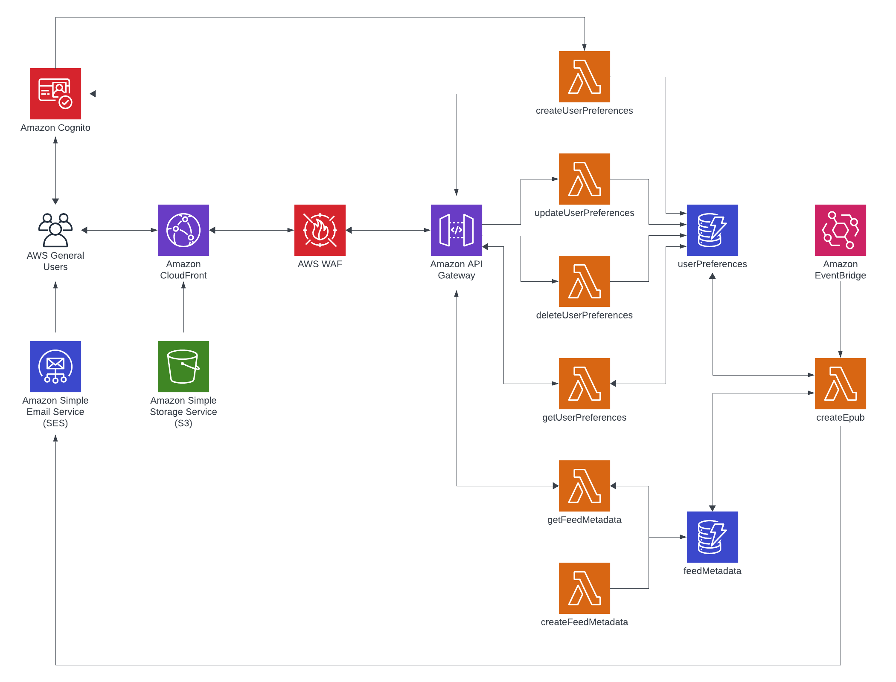

<div align="center">

</div>

---

# newsbrake

Daily delivery, at a user-specified time, of Creative Commons-licensed news to Kindle devices by packaging RSS feeds into epub files.

## Demo


## Motivation
This project started out of a desire for a slower, more intentional consumption of news that is well-researched, independent, and accessible. First and third-party options for the Kindle either are not freely accessible, do not provide news sources and feeds that align with this ethos, or do not automate scheduled delivery.

## Design
### Architecture Diagram


### Frontend
The React single-page application is served through CloudFront and hosted on a Cloudflare domain. Authentication is performed using a Cognito user pool.

#### Considerations
*SPA vs. MPA*: SPA was selected given the project's main purpose of serving an application interface, instead of a content-focused website, to configure user feed preferences.

*Cognito as the identity provider*: The application primarily leverages AWS services, which Cognito integrates seamlessly with.

### Backend
User preferences stored in DynamoDB and displayed in the frontend are fetched and set via Lambda functions integrated with API Gateway, which is used to throttle requests and is protected by WAF. There is a Lambda function, invoked hourly by an EventBridge rule, to fetch users with the corresponding preferred time, generate epub files customized to their preferences, and send to their Send to Kindle email addresses with SES.

#### Considerations
*DynamoDB vs. RDS*: The choice of DynamoDB was made for two reasons. The first reason is for the simple, predictable queries when setting or fetching user preferences. The second reason is for its integration with Lambda and, more generally, its serverless nature, given that the setting of user preferences is expected to be infrequent and the fetching of user preferences for epub generation occurs hourly for a short duration.

*WAF geographic match rule*: Given the application's current focus on countries representing the majority of the Kindle market share, a WAF rule is currently set to allow application access only from the United States and Canada.

## Project Status
This project is a work-in-progress. The following items remain to be completed:

<ul>
    <li>Create prod stage with S3 stack</li>
    <li>Parallelize epub creation</li>
    <li>Create terms and privacy policy</li>
    <li>Add unit and integration tests</li>
    <li>Add continuous deployment using AWS CodePipeline or GitHub Actions</li>
    <li>Pub/sub budget alerts and actions using SNS and Lambda</li>
</ul>

## Usage
To run this project locally, an AWS account is required along with the AWS CLI:
```
pip install awscli
aws configure
```
Deploy the CDK stack to your AWS account and start the frontend server:
```
pnpm run deploy
cd frontend
pnpm run dev
```